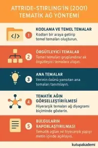

# MAXQDA ile Tematik Analiz Hizmeti

Nitel veri analizi, araştırmalarda derinlemesine içgörüler elde etmek için kullanılan önemli bir yöntemdir. Özellikle **MAXQDA ile tematik analiz**, verileri sistematik olarak organize etmek ve yorumlamak için güçlü araçlar sunar. Bu makalede, [MAXQDA](https://www.maxqda.com/tr) kullanarak tematik analizin nasıl yapılacağını, kodlama süreçlerini ve raporlama tekniklerini detaylı bir şekilde ele alacağız.

Bununla birlikte, araştırmanızın bilimsel niteliğini artırmak ve daha güvenilir sonuçlar elde etmek için profesyonel destek almak da mümkündür. MAXQDA ile içerik ve tematik analiz hizmetimiz sayesinde verileriniz titizlikle incelenir, akademik standartlara uygun raporlar hazırlanır ve çalışmalarınızın değerine katkı sağlanır. Eğer siz de tez, makale ya da araştırmanızda MAXQDA ile içerik ve tematik analiz desteği almak istiyorsanız bizimle [iletişime](https://kutupakademi.com/iletisim/) geçebilir, aynı zamanda bu yazının devamında yer alan adım adım rehberle yöntemin tüm inceliklerini öğrenerek kendi çalışmalarınızda uygulama fırsatı bulabilirsiniz.

## 📌 Tematik Analiz Nedir ve Neden Önemlidir?

**Tematik analiz**, nitel veriler içindeki örüntüleri belirlemek, anlamlandırmak ve yorumlamak için kullanılan bir yöntemdir. Özellikle röportajlar, odak grup görüşmeleri, açık uçlu anket yanıtları ve diğer metinsel veriler üzerinde sıklıkla uygulanır.

**✅** **Tematik analizin avantajları:**  
✔ Veriler içindeki anlamlı temaları keşfetmeye yardımcı olur.  
✔ Araştırma sorularına sistematik bir şekilde yanıt verir.  
✔ Nitel veriyi daha organize ve yorumlanabilir hale getirir.

## 📌 MAXQDA, Tematik Analizde Neden Tercih Edilir?

MAXQDA, kullanıcı dostu arayüzü ve güçlü kodlama araçlarıyla nitel veri analizinde en çok kullanılan yazılımlardan biridir. Özellikle **MAXQDA ile tematik analiz**, verileri düzenlemek, görselleştirmek ve yorumlamak için gelişmiş seçenekler sunar.

## 📌 MAXQDA ile Tematik Analiz Nasıl Yapılır?

Analiz sürecinin ilk adımı, kullanılacak veri setinin dikkatlice hazırlanmasıdır. Bu aşamada, metin, ses, video veya PDF formatındaki veriler toplanır ve düzenlenir. Verilerin bütünlüğü ve kalitesi, analiz sonuçlarının güvenilirliği açısından kritik öneme sahiptir. Toplanan veriler, MAXQDA yazılımına aktarılırken, her bir dosyanın doğru bir şekilde tanımlandığından ve uygun kategorilere ayrıldığından emin olunmalıdır. Bu, analiz sürecinin daha düzenli ve verimli ilerlemesine katkıda bulunur.

### 1️⃣ Veri Setinin Hazırlanması ve İçeriğin Aktarılması

*   **Veri türünü belirleyin:** Analize başlamadan önce hangi tür verilerle çalışacağınızı netleştirin. MAXQDA; metin dökümleri (mülakat, odak grup, açık uçlu anket), görseller, ses kayıtları ve video dosyalarıyla uyumludur.
    
*   **Ham verileri sisteme aktarın:** Metinleri olduğu gibi, hiçbir ifadeyi atlamadan programa yükleyin. Ses ve video kayıtlarını aktarırken mümkünse zaman damgaları ekleyin. Böylece ileride kodlama sırasında önemli bölümlere kolayca ulaşabilirsiniz.
    
*   **Veri setini düzenleyin:** Aktarılan içerikleri kategorilere ayırarak organize edin. Bu kategoriler; araştırma soruları, temalar, katılımcı grupları veya veri toplama yöntemine göre olabilir.
    
*   **Örnek bir sınıflama yapın:** Örneğin, farklı yaş gruplarına ait mülakatları ayrı klasörlere ayırabilir veya farklı konulara yönelik dökümleri etiketleyerek saklayabilirsiniz.
    
*   **Analiz için hazırlık yapın:** Bu aşamayı yalnızca teknik bir aktarım değil, aynı zamanda veriye ilk bakış ve zihinsel çerçeve oluşturma süreci olarak görün. Böylece ilerleyen kodlama ve tematik analiz adımlarınız çok daha sistematik ilerler.
    

### 2️⃣ Tematik Analiz için Kodlama Süreci

Kodlama, verilerdeki anlamlı bölümlerin belirli kavramlar veya temalar altında gruplandırılması işlemidir. Bu süreç, verilerin derinlemesine analiz edilmesini ve yorumlanmasını kolaylaştırır. Kodlama süreci genellikle üç aşamada gerçekleştirilir:​

*   **Açık Kodlama:** Veri seti satır satır incelenerek, önemli görülen ifadeler veya kavramlar belirlenir ve bunlara uygun kodlar atanır. Bu aşamada, veriler parçalarına ayrılır ve her bir parça için açıklayıcı etiketler oluşturulur. Bu işlem, araştırmacının veriyi daha küçük ve yönetilebilir bileşenlere ayırmasına yardımcı olur. ​
    
*   **Eksenel Kodlama:** Açık kodlama sırasında oluşturulan kodlar arasındaki ilişkiler incelenir ve benzer kodlar bir araya getirilerek alt kategoriler oluşturulur. Bu aşama, veriler arasındaki bağlantıların ve örüntülerin daha iyi anlaşılmasını sağlar. Örneğin, farklı kodlar arasındaki nedensel ilişkiler veya koşullar belirlenebilir. ​
    
*   **Seçici Kodlama:** Eksenel kodlama ile belirlenen alt kategoriler, daha geniş temalar altında toplanarak ana kategoriler oluşturulur. Bu aşamada, araştırmanın temel bulguları ve ana temaları belirginleşir. Seçici kodlama, araştırmacının verilerden yola çıkarak teorik bir çerçeve oluşturmasına yardımcı olur.
    

### 3️⃣ MAXQDA ile Kodlama Teknikleri

MAXQDA, kodlama sürecini kolaylaştıran ve hızlandıran çeşitli araçlar sunar:​

*   **Otomatik Kodlama:** Belirli anahtar kelimeler veya ifadeler için yazılımın otomatik olarak kod atamasını sağlar. Bu özellik, büyük veri setlerinde zaman tasarrufu sağlar ve tutarlılığı artırır. Ancak, otomatik kodlama sonrasında manuel bir kontrol yaparak, atanan kodların doğruluğunu ve uygunluğunu değerlendirmek önemlidir. ​
    
*   **Serbest Kodlama:** Araştırmacının veriyi okurken, önemli bulduğu bölümleri manuel olarak kodlamasına imkân tanır. Bu yöntem, araştırmacının sezgisel ve esnek bir şekilde çalışmasına olanak sağlar. Serbest kodlama sırasında, yeni kodlar oluşturulabilir veya mevcut kodlar kullanılabilir.
    
*   **Hiyerarşik Kodlama:** Kodlar arasında ana ve alt kod ilişkileri kurarak, verilerin daha organize bir şekilde analiz edilmesini sağlar. Bu yapı, temaların ve alt temaların daha net bir şekilde görülmesine yardımcı olur. Hiyerarşik kodlama, özellikle karmaşık veri setlerinde, veriler arasındaki ilişkileri daha iyi anlamak için faydalıdır.

### 4️⃣ Temaların Görselleştirilmesi ve Analiz Sonuçlarının Yorumlanması

📊 MAXQDA, **tematik analiz için en iyi uygulamalar** arasında yer alan veri görselleştirme araçlarını içerir. Kod matrisleri, kelime bulutları ve grafikler ile verilerinizi etkili şekilde sunabilirsiniz. MAXQDA, nitel veri analizinde elde edilen bulguların daha anlaşılır ve etkili bir şekilde sunulabilmesi için çeşitli görselleştirme araçları sunmaktadır. Bu araçlar sayesinde, karmaşık veri setleri daha sade ve yorumlanabilir hale getirilir.

**✔Kod Matris Tarayıcısı**

Kod Matris Tarayıcısı, belirli kodların farklı belgelerdeki dağılımını ve yoğunluğunu görsel olarak temsil eden bir araçtır. Bu matris, satırlarda kodları, sütunlarda ise belgeleri gösterir. Hücrelerdeki renk yoğunluğu veya boyutları, ilgili kodun o belgede ne kadar sıklıkla geçtiğini belirtir. Bu sayede, araştırmacılar belirli temaların hangi belgelerde daha baskın olduğunu hızlıca tespit edebilirler. Örneğin, bir mülakat çalışmasında “memnuniyet” kodunun hangi katılımcılarda daha fazla vurgulandığını bu matris aracılığıyla görebilirsiniz.

**✔Kelime Bulutları**

Kelime bulutları, metin içerisindeki kelimelerin frekansına dayalı olarak oluşturulan görsellerdir.Sık kullanılan kelimeler daha büyük ve belirgin şekilde gösterilirken, daha az kullanılanlar daha küçük boyutlarda sunulur.Bu görselleştirme, metindeki ana temaları ve odak noktalarını hızlıca belirlemek için idealdir.MAXQDA’da kelime bulutları oluşturmak için ilgili metinleri seçip, “Kelime Bulutu” aracını kullanarak anında görselleştirme yapabilirsiniz.Bu yöntem, özellikle büyük veri setlerinde öne çıkan kavramları tespit etmek için faydalıdır.

**✔Grafikler ve Diyagramlar**

MAXQDA, verilerinizi grafikler ve diyagramlar şeklinde sunmanıza da olanak tanır.Örneğin, kodların zaman içindeki dağılımını gösteren çizgi grafikleri veya farklı temaların birbirleriyle ilişkisini gösteren ağ diyagramları oluşturabilirsiniz.Bu tür görselleştirmeler, veriler arasındaki ilişkileri ve trendleri daha net bir şekilde ortaya koymanıza yardımcı olur.Ayrıca, bu grafikler raporlarınızda veya sunumlarınızda bulgularınızı desteklemek için etkili araçlardır.

Sonuç olarak, MAXQDA’nın sunduğu bu görselleştirme araçları, nitel veri analizinde elde edilen bulguların daha anlaşılır, etkili ve profesyonel bir şekilde sunulmasına katkı sağlar. Bu araçları etkin bir şekilde kullanarak, araştırmanızın derinliğini ve kapsamını daha iyi yansıtabilir, okuyucularınızın verilerinizi daha kolay anlamasını sağlayabilirsiniz.

## 📌 MAXQDA ile Tematik Analiz Yöntemleri

Nitel araştırmalarda kullanılan tematik analiz, verilerden anlamlı örüntüler çıkarmak için farklı yöntemsel yaklaşımlar sunar. MAXQDA, bu yöntemlerin uygulanmasını kolaylaştıran güçlü araçlar sağlar. Aşağıda, literatürde en çok kullanılan iki yöntem olan **Braun ve Clarke’ın (2006) tematik analiz yaklaşımı** ile **Attride-Stirling’in (2001) tematik ağ yöntemi** detaylı biçimde ele alınacaktır.

### 1\. Braun ve Clarke’ın (2006) Tematik Analiz Yöntemi

**Braun ve Clarke’ın (2006) tematik analiz yöntemi**, literatürde en çok atıf alan ve en yaygın kullanılan yaklaşımlardan biridir. MAXQDA ile yapılan tematik analizlerde bu yöntem, araştırmacılara altı adımlı sistematik bir çerçeve sunar. Esnek yapısı sayesinde özellikle **psikoloji, eğitim ve sosyal bilimler** alanlarında sıkça tercih edilir.

Aşağıda, **Braun ve Clarke’ın 6 adımlı tematik analiz süreci** MAXQDA üzerinde nasıl uygulanır detaylıca açıklanmıştır:

**1) Veriye Aşinalık Kazanma**

*   Tüm metin, ses ve video verilerini **MAXQDA’ya aktarın**. Gerekirse ses/video kayıtlarını yazıya dökün.
    
*   Belgeleri baştan sona okuyun veya izleyin; ilk izlenimlerinizi **document memos** olarak kaydedin.
    
*   **Paraphrase aracı** ile paragrafları özetleyin ve önemli alıntıları işaretleyin.
    
*   Bu aşamada temaları zorlamayın; öncelikle veriyle tanışın ve bağlamı anlayın.
    

**2) İlk Kodların Üretilmesi (Open Coding)**

*   Metindeki anlamlı bölümleri seçin ve **in-vivo kodlama** ya da kısa tanımlayıcı kodlarla etiketleyin.
    
*   **Code System** altında kodları hiyerarşik biçimde düzenleyin; her koda açıklama ve örnekler ekleyin.
    
*   Büyük veri setlerinde **Auto Code (Search & Autocode)** işlevini kullanın; çıkan sonuçları mutlaka kontrol edin.
    
*   Birden fazla kodlayıcı varsa, küçük bir alt kümede **intercoder agreement** testi yaparak kodlama kurallarını netleştirin.
    

**3) Aday Temaların Belirlenmesi**

*   Birbirine yakın kodları gruplandırarak **aday temalar** oluşturun.
    
*   **MAXMaps** aracılığıyla kod kümelerini görselleştirin ve ilişkileri kavramsallaştırın.
    
*   **Code Matrix Browser** veya **Summary Grid** ile temaların katılımcılar/dokümanlar arasında nasıl dağıldığını inceleyin.
    

**4) Temaların Gözden Geçirilmesi**

*   **Düzey-1 (alıntı düzeyi):** Her temaya bağlı alıntılar tutarlı mı? Gerekirse temayı bölün, birleştirin veya kodları yeniden atayın.
    
*   **Düzey-2 (tüm veri seti):** Temalar veri setinin bütününü kapsıyor mu, araştırma sorularına yanıt veriyor mu?
    
*   **Code Relations Browser** kullanarak temalar arasındaki ilişkileri ve örtüşmeleri inceleyin; gereksiz veya yalnız kalan kodları çıkarın.
    

**5) Temaların Tanımlanması ve Adlandırılması**

*   Her tema için **öz tanım** yazın: çekirdek fikir, alt boyutlar, kapsam ve sınırlar.
    
*   Kısa, hatırlanabilir ve açıklayıcı **tema adları** seçin; bunları veri alıntılarıyla destekleyin.
    
*   Her tema için 2–3 güçlü örnek alıntı seçin; katılımcı bilgisiyle etiketleyin.
    
*   **Kod kitabınızı (codebook)** güncelleyerek raporlamada tutarlılık sağlayın.
    

**6) Raporun Üretilmesi (Analitik Anlatı + Kanıt)**

*   Araştırma sorularınıza dönün ve her temayı **kuramsal çerçeveyle ilişkilendirerek** açıklayın.  
      
    
*   Temaları, **MAXMaps tematik haritaları** ve özet tablolarla (tema tanımı, alt temalar, alıntılar) destekleyin.  
      
    
*   Yöntem bölümünde şeffaflık sağlayın: veri türleri, örneklem, kodlama süreci, güvenilirlik ve araştırmacı yansıtması.  
      
    
*   Bulgular bölümünde, temaların **kuramsal ve pratik katkılarını** net biçimde aktarın; aktarılabilirliğe ve gelecek araştırma önerilerine yer verin.

### 2\. Attride-Stirling’in (2001) Tematik Ağ (Thematic Network) Yöntemi

**Attride-Stirling’in tematik ağ yöntemi (thematic network analysis)**, nitel araştırmalarda veriyi yalnızca kodlarla sınırlı tutmayıp, temalar arasındaki ilişkileri görselleştirerek analiz sürecini daha sistematik ve anlaşılır hale getirir. Bu yöntem özellikle **MAXQDA ile tematik analiz** süreçlerinde tercih edilir, çünkü araştırmacıya veriyi hiyerarşik düzeylerde organize etme ve şematik bir ağ yapısı oluşturma imkânı tanır.

Attride-Stirling’in yaklaşımı üç temel katmandan oluşur: **temel temalar (basic themes)**, **örgütleyici temalar (organizing themes)** ve **ana temalar (global themes)**. Bu katmanlar adım adım aşağıda açıklanmıştır:

**1) Kodlama ve Temel Temaların (Basic Themes) Çıkarılması**

*   Verideki anlamlı ifadeleri ve alıntıları kodlayın.
    
*   Kodları bir araya getirerek **temel temaları** oluşturun.
    
*   Bu temalar, veriden doğrudan çıkan en küçük anlamlı birimlerdir.
    
*   Örnek: “öğrencilerin motivasyon eksikliği” veya “öğretmen desteğinin yetersizliği”.
    

**2) Örgütleyici Temaların (Organizing Themes) Belirlenmesi**

*   Benzer veya ilişkili temel temaları gruplandırın.
    
*   Bu gruplar, daha üst düzey açıklamalar sunan **örgütleyici temaları** oluşturur.
    
*   Örgütleyici temalar, verideki ana örüntüleri ortaya çıkarır.
    
*   Örnek: “eğitim sürecinde engeller” ya da “sosyal destek kaynakları”.
    

**3) Ana Temaların (Global Themes) Tanımlanması**

*   Birden fazla örgütleyici temayı bir araya getirerek **ana temaları** çıkarın.
    
*   Ana temalar, araştırma sorularının özüne yanıt veren en üst düzey kavramlardır.
    
*   Çalışmanın merkezinde yer alan genel bulguları temsil eder.
    
*   Örnek: “öğrenme motivasyonunu etkileyen faktörler”.
    

**4) Tematik Ağın Görselleştirilmesi**

*   MAXQDA’nın **MAXMaps** veya benzeri görselleştirme araçlarıyla, temel–örgütleyici–ana temaları hiyerarşik biçimde gösterin.
    
*   Ortada **ana tema**, onun etrafında örgütleyici temalar ve en dışta temel temalar olacak şekilde ağ diyagramı oluşturun.
    
*   Bu ağ, verideki ilişkileri açık ve görsel bir biçimde sunar.
    

**5) Tematik Ağın Analizi ve Yorumlanması**

*   Her ana tema için ilişkili örgütleyici ve temel temaları inceleyin.
    
*   Temaların araştırma sorularına nasıl yanıt verdiğini tartışın.
    
*   Tematik ağdaki bağlantıları, güçlü örnek alıntılarla destekleyin.
    

**6) Bulguların Raporlaştırılması**

*   Tematik ağları metin içinde açıklayın ve görsel diyagramlarla destekleyin.
    
*   Bulguları, önce temel temalardan başlayarak örgütleyici temalara ve en sonunda ana temalara doğru hiyerarşik biçimde raporlayın.
    
*   Bu yapı sayesinde okur, araştırmanın mantıksal akışını kolayca takip eder.
    

  

## 📌 MAXQDA ile Tematik Analiz Yaparken Nelere Dikkat Etmelisiniz?

**🔹** **Veri Gizliliği ve Etik Kurallar:**  
Araştırma verilerinin anonimleştirilmesi ve etik kurallara uygun şekilde saklanması önemlidir.

**🔹** **Kodlama ve Temaları Doğru Belirleme:**  
Kodlar, temalar ve alt temalar arasında mantıklı bağlantılar kurarak analiz sürecini güvenilir hale getirin.

**🔹** **Araştırma Sorularına Uygun Kodlama Yapısı Kurma:**  
Kodlama süreci, çalışmanızın temel araştırma sorularına doğrudan cevap verecek şekilde ilerlemelidir.

## 📌 MAXQDA Tematik Analiz Hizmeti Fiyatları ve Paketleri

Nitel veri analizi hizmetleri fiyatlandırması;  
✔ Veri setinin büyüklüğüne,  
✔ Kodlama ve tema çıkarma sürecine,  
✔ Raporlama formatına göre değişiklik göstermektedir.

💰 En uygun fiyatlı nitel veri analizi hizmetleri hakkında bilgi almak için bizimle iletişime geçin!

## 📌 Sıkça Sorulan Sorular (SSS)

MAXQDA ile tematik analiz nasıl yapılır?

📌 MAXQDA’da veri seti içe aktarılarak kodlama yapılır, ardından temalar belirlenir ve analiz sonuçları raporlanır.

MAXQDA kullanarak tematik analiz ne kadar sürer?

📌 Verinin büyüklüğüne bağlı olarak birkaç gün sürebilir.

MAXQDA ile hangi nitel analiz yöntemleri uygulanabilir?

📌 Tematik analiz, içerik analizi, söylem analizi ve anlatı analizi MAXQDA ile uygulanabilir.

## 📌 Sonuç: MAXQDA ile Tematik Analiz Yaparak Araştırmalarınızı Güçlendirin

MAXQDA, **nitel veri analizi ve tematik analiz** için güçlü araçlar sunar. **MAXQDA ile tematik analiz yaptırmak**, verilerinizi daha sistematik bir şekilde işlemenize ve akademik çalışmalarınızın güvenilirliğini artırmanıza yardımcı olur.

📌 **Siz de profesyonel bir tematik analiz yaptırmak veya [nitel veri analizi](https://kutupakademi.com/nitel-veri-analizi-yaptirma/) desteği almak istiyorsanız hemen bizimle iletişime geçin!** 🚀Profesyonel bir tematik analiz örneği görmek isterseniz mutlaka bize ulaşın!

Hızlı İletişim Hattı