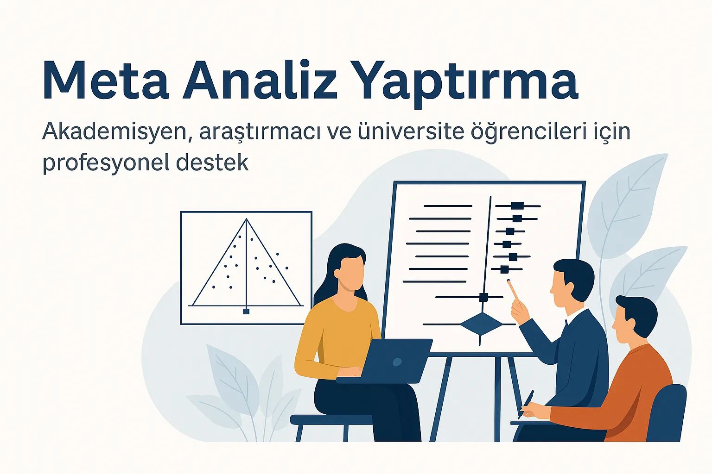
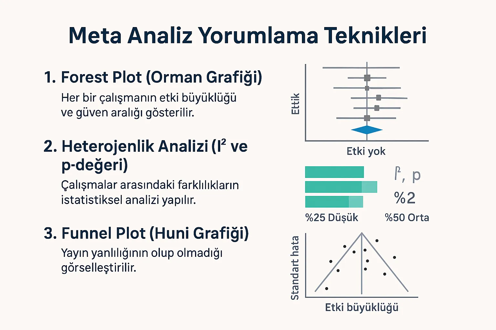
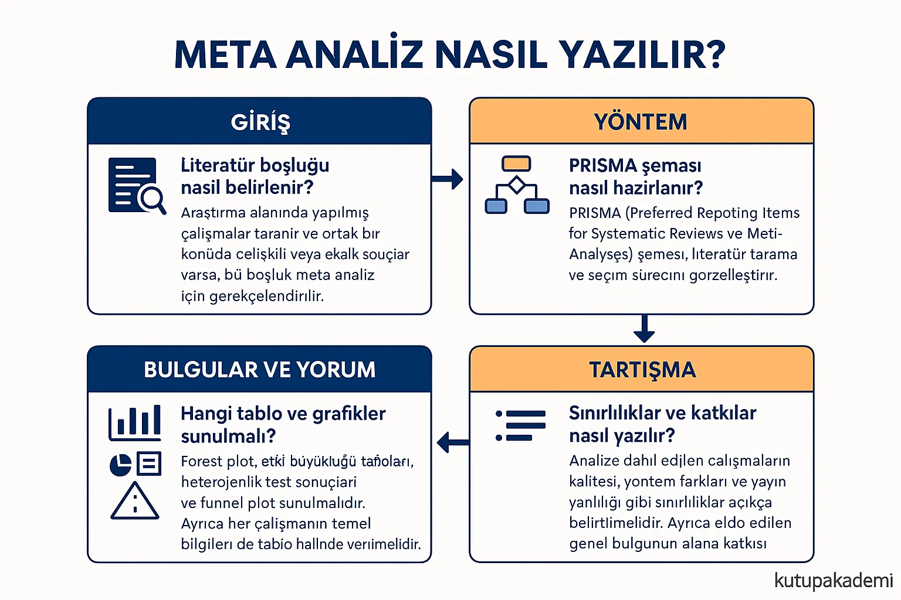
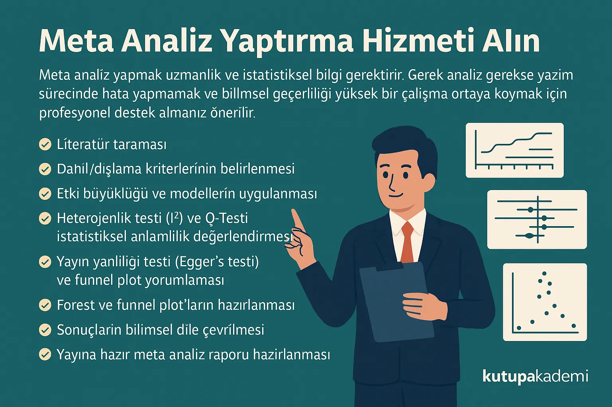

# Meta Analiz Yaptırma

Meta analiz; çok sayıda bağımsız bilimsel çalışmanın istatistiksel bulgularını belirli kriterlere göre bir araya getirerek genel bir etki büyüklüğü hesaplayan güçlü bir analiz yöntemidir. nicel verilerini bir araya getirerek istatistiksel olarak birleştiren bir analiz yöntemidir. Bu sayede tek tek çalışmaların ötesine geçerek daha güçlü, güvenilir ve genellenebilir sonuçlara ulaşılır. Klinik deneylerden eğitim araştırmalarına kadar birçok alanda kullanılan bu yöntem, bilimsel kanıtları sentezlemek ve karar verme süreçlerine ışık tutmak için tercih edilir.

Diğer analiz türlerinden farkı, bireysel verilerle değil, yayımlanmış çalışmaların istatistiksel çıktılarıyla çalışmasıdır. Bu nedenle, meta analiz hem akademik yayınlarda daha yüksek etki yaratır hem de literatürdeki bilgi yığınını sistemli biçimde anlamlandırır.

Eğer siz de tezinizde ya da bilimsel yayınlarınızda literatürden güçlü sonuçlar üretmek istiyorsanız, profesyonel meta analiz hizmetimizle size destek olabiliriz. Sayfanın devamında, yöntemden raporlamaya kadar tüm süreçleri adım adım inceleyebilir, meta analiz yaptırmak için hemen bizimle iletişime geçebilirsiniz.

## Meta Analiz Nedir?

Meta analiz genellikle sistematik inceleme ile birlikte anılır. Ancak bu iki yöntem farklı amaçlara hizmet eder:

*   **Sistematik inceleme**, belirli kriterlere göre literatürü tarar, çalışmaların içeriklerini özetler ve nitel bir yorum sunar.
    
*   **Meta analiz** ise bu çalışmaların istatistiksel sonuçlarını (etki büyüklüklerini) bir araya getirerek sayısal bir genel sonuç üretir.
    

Örnek: Öğretmenlerin dijital okuryazarlığı ile öğrenci başarısı arasındaki ilişkiyi inceleyen 30 çalışmayı sistematik olarak tarayıp özetlersiniz (sistematik inceleme). Ancak bunların istatistiksel çıktıları üzerinden genel bir korelasyon katsayısı hesaplıyorsanız, bu bir meta analizdir.

Dahil Etme ve Dışlama Kriterleri​

Dahil etme ve dışlama kriterleri, analizde kullanılacak çalışmaların belirlenmesinde rehberlik eder. Bu kriterler şunları içerebilir:

*   **Yayın Dili ve Tarihi:** Örneğin, yalnızca 2015 sonrası ve İngilizce ya da Türkçe yayınlanmış çalışmalar.
    
*   **Katılımcı Özellikleri:** Belirli yaş aralığı, meslek grubu veya eğitim düzeyi.
    
*   **Araştırma Yöntemi:** Deneysel, yarı-deneysel, korelasyonel vs.
    
*   **Veri Türü:** Sayısal sonuç bildiren çalışmalar dahil edilirken, yalnızca görüşme verisi içerenler hariç tutulabilir.
    

Bu kriterlerin önceden belirlenmesi, seçilen çalışmaların homojenliğini ve analiz güvenilirliğini artırır.

## Meta Analiz Yorumlama Teknikleri

Meta analiz sonucunun doğru şekilde yorumlanması, elde edilen bulguların güvenilirliğini ve bilimsel katkısını belirlemek açısından büyük önem taşır. Bu amaçla kullanılan grafik ve istatistiksel ölçütler yalnızca sayısal verileri sunmakla kalmaz, aynı zamanda çalışmanın kalitesine ve genellenebilirliğine dair güçlü ipuçları verir.

## 1\. Forest Plot (Orman Grafiği)

Forest plot, meta analizdeki temel görselleştirme aracıdır. Her bir çalışmanın etki büyüklüğü ve güven aralığı yatay bir çizgiyle gösterilir. Bu grafik:

*   Hangi çalışmaların daha büyük ya da küçük etki bildirdiğini,
    
*   Güven aralıklarının genişliğini,
    
*   Genel etkinin hangi yönde olduğunu açıkça gösterir.
    

Grafikteki merkez çizgi genellikle “etki yok” sınırını (örneğin d = 0) temsil eder. Genel etki büyüklüğü, alt kısımdaki elmas (diamond) figürüyle özetlenir. Bu grafik, çalışmanın okuyucularına hızlı ve net bir genel bakış sağlar.

## 2\. Heterojenlik Analizi (I² ve p-değeri)

Heterojenlik, analizde yer alan çalışmaların sonuçları arasında ne kadar farklılık olduğunu gösterir. Bu farkların tesadüfi mi yoksa sistematik mi olduğunu anlamak için kullanılır:

*   **I² değeri:** Çalışmalar arası farkın yüzdesel ifadesidir. Yüksek I² değeri, sonuçların birbirinden çok farklı olduğunu gösterir.
    
    *   %25: Düşük heterojenlik
        
    *   %50: Orta düzey
        
    *   %75+: Yüksek heterojenlik
        
*   **Q testi p-değeri:** Heterojenliğin istatistiksel olarak anlamlı olup olmadığını test eder.
    

Bu değerler, sabit etkili model mi yoksa rastgele etkili model mi kullanılacağına karar verirken belirleyici olur.

## 3\. Funnel Plot (Huni Grafiği)

Funnel plot, meta analizde yayın yanlılığını kontrol etmek için kullanılır. Özellikle pozitif sonuçların daha sık yayımlanması, literatürde dengeyi bozabilir. Bu grafik:

*   Çalışma örneklem büyüklüklerini ve etki büyüklüklerini iki eksende göstererek olası dengesizlikleri ortaya koyar.
    
*   Simetrik yapı → yayın yanlılığı yok
    
*   Asimetrik yapı → yayın yanlılığı olabilir
    

Detaylı analiz gerektiğinde Egger’s testi ve Duval & Tweedie gibi ileri yöntemler de kullanılır. Yayın yanlılığı tespit edilirse sonuçların güvenilirliği sorgulanabilir, bu nedenle funnel plot oldukça kritiktir.

*   Yayın yanlılığı olup olmadığını test etmek için kullanılır.
    
*   Simetrik huni: Yayın yanlılığı düşük.
    
*   Asimetri: Muhtemelen pozitif sonuçlar daha fazla yayınlanmış.
    

Gerekirse Egger’s testi ve Duval & Tweedie trim-and-fill yöntemi ile yayın yanlılığı daha detaylı değerlendirilebilir.

## Meta Analiz Çalışması Örneği

Örneğin, “dijital oyun tabanlı öğrenme yöntemlerinin akademik başarıya etkisi” konulu bir meta analiz çalışması yapıldığını varsayalım. Bu çalışmada şu adımlar izlenir:

1.  **Literatür Taraması:** Scopus, Web of Science, ERIC gibi veri tabanlarında belirlenen anahtar kelimeler (örn. “digital game-based learning”, “academic achievement”) ile yayınlar taranır.
    
2.  **Dahil Etme Kriterleri:** Yalnızca deneysel araştırmalar, belirli yaş grupları ve belirli ölçme araçları ile yapılmış çalışmalar dahil edilir.
    
3.  **Veri Seti:** Belirlenen kriterleri karşılayan 20 çalışma seçilir.
    
4.  **Etki Büyüklüğü Hesaplama:** Her çalışmadan Cohen’s d veya Hedges’ g gibi etki büyüklüğü değerleri çıkarılır.
    
5.  **Model Seçimi:** Çalışmaların metodolojik ve örneklem farklılıkları nedeniyle rastgele etkili model tercih edilir.
    
6.  **Yorumlama:**
    
    *   Forest plot ile genel etki büyüklüğü görselleştirilir (örnek: d = 0.48 \[0.35, 0.60\], orta düzey etki).
        
    *   I² değeri %42 → orta düzey heterojenlik.
        
    *   Funnel plot simetrik → yayın yanlılığı riski düşük.
        

Bu sonuçlar yorumlanarak meta analiz çalışmasında şu tür çıkarımlar yapılabilir:

*   Dijital oyun tabanlı öğrenme yöntemleri, akademik başarı üzerinde olumlu ve anlamlı etki yaratmaktadır.
    
*   Yayın yanlılığı veya metodolojik çeşitlilik sınırlı düzeydedir.
    
*   Eğitim teknolojileriyle ilgili politika ve uygulamalarda bu sonuçlar dikkate alınabilir.
    

## Meta Analiz Nasıl Yazılır?

**Giriş – Literatür boşluğu nasıl belirlenir?**

Araştırma alanında yapılmış çalışmalar taranır ve ortak bir konuda çelişkili veya eksik sonuçlar varsa, bu boşluk meta analiz için gerekçelendirilir.

**Yöntem – PRISMA şeması nasıl hazırlanır?**

[PRISMA (Preferred Reporting Items for Systematic Reviews and Meta-Analyses)](https://www.prisma-statement.org/) şeması, literatür tarama ve seçim sürecini görselleştirir. Kaç çalışma bulunduğu, kaçı elendiği ve neden elendiği şemada gösterilir.

**Bulgular ve Yorum – Hangi tablo ve grafikler sunulmalı?**

Forest plot, etki büyüklüğü tabloları, heterojenlik test sonuçları ve funnel plot sunulmalıdır. Ayrıca her çalışmanın temel bilgileri de tablo halinde verilmelidir.

**Tartışma – Sınırlılıklar ve katkılar nasıl yazılır?**

Analize dahil edilen çalışmaların kalitesi, yöntem farkları ve yayın yanlılığı gibi sınırlılıklar açıkça belirtilmelidir. Ayrıca elde edilen genel bulgunun alana katkısı yorumlanmalıdır.

 

## Meta Analiz Yaptırma Hizmeti Alın

Meta analiz yapmak uzmanlık ve istatistiksel bilgi gerektirir. Gerek analiz gerekse yazım sürecinde hata yapmamak ve bilimsel geçerliliği yüksek bir çalışma ortaya koymak için profesyonel destek almanız önerilir.

Hizmet kapsamında:

*   Literatür taraması
    
*   Dahil/dışlama kriterlerinin belirlenmesi
    
*   Etki büyüklüğü ve modellerin uygulanması
    
*   Heterojenlik testi (I²) ve Q-Testi istatistiksel anlamlılık değerlendirmesi
    
*   Yayın yanlılığı testi (Egger’s testi ) ve funnel plot yorumlaması
    
*   Forest ve funnel plot’ların hazırlanması
    
*   Sonuçların bilimsel dile çevrilmesi
    
*   Yayına hazır meta analiz raporu hazırlanması
    

için destek veriyoruz.

**[İletişim](https://www.kutupakademi.com/iletisim/)** sayfasında yer alan formdan hemen teklif alabilirsiniz. Diğer profesyonel destek alanlarımızı keşfetmek için **[Hizmetlerimiz](https://www.kutupakademi.com/hizmetlerimiz/)** sayfasına göz atabilirsiniz. Ya da whatsapp iletişim hattımızdan direk bizimle irtibata geçebilirsiniz. Hemen arayın!

Hızlı İletişim Hattı